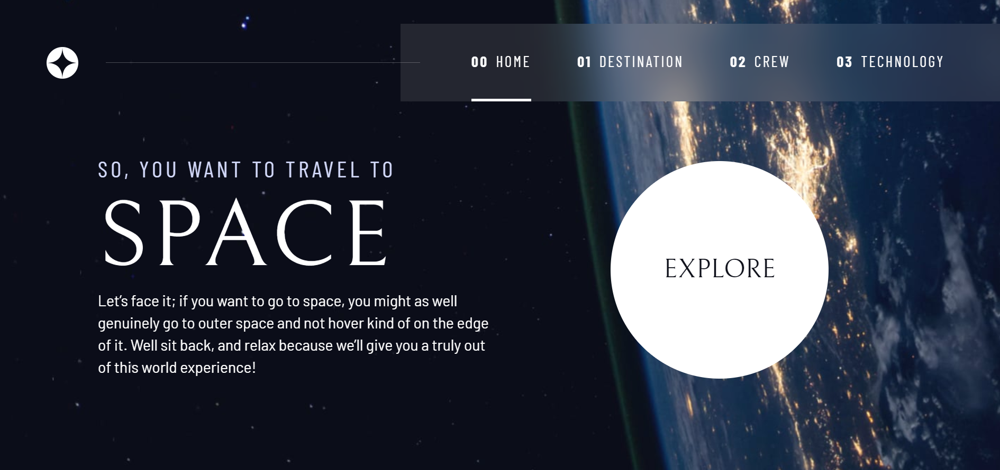

## Table of contents

  - [The challenge](#the-challenge)
  - [Screenshot](#screenshot)
  - [Links](#links)
- [My process](#my-process)
  - [Built with](#built-with)
  - [What I learned](#what-i-learned)
  - [Continued development](#continued-development)
  - [Useful resources](#useful-resources)
- [Author](#author)
- [Acknowledgments](#acknowledgments)

### The challenge

Users should be able to:

- View the optimal layout for the component depending on their device's screen size
- Move easily between elements and pages.

### Screenshot

### Links

- Solution URL:(https://github.com/SlimBloodworth/front-end-mentor-space-tourism)
- Live Site URL:(https://slimbloodworth.github.io/front-end-mentor-space-tourism/)

## My process

### Built with

- Semantic HTML5 markup
- CSS custom properties
- Flexbox
- CSS Grid
- Mobile-first workflow

### What I learned

I learned a lot about how to implement WCAG for multiple needs, I got a great lesson in CSS grid, more experience with flex and responsive design, really wonderful JavsScript basics.

### Continued development

I loved this project and will continue to expand it. I am currently work on making more planets as well as chaning the current planets by using THREE.js for 3d effects.

### Useful resources

- [Scrimba](https://scrimba.com/learn/spacetravel) - This helped me with not just the project, but a better understanding of how to implement WCAG standards.

## Author

- Website - [Michelle Renee](https://slimbloodworth.editorx.io/portfolio)
- Facebook - [Creative Software Solutions](https://www.facebook.com/profile.php?id=100073842390690)
- CodePen - [@slimbloodworth](https://codepen.io/slimbloodworth)
- LinkedIn - [Michelle Renee](https://www.linkedin.com/in/michelle-renee-99b455187/)
- GitHub - [@slimbloodworth](https://github.com/SlimBloodworth)

## Acknowledgments

Thanks to Kevin Powell, Scrimba and Front End Mentor for such a fun project!

